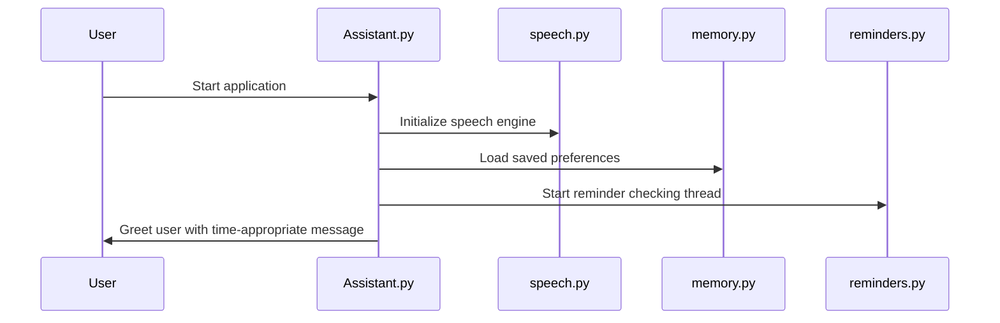
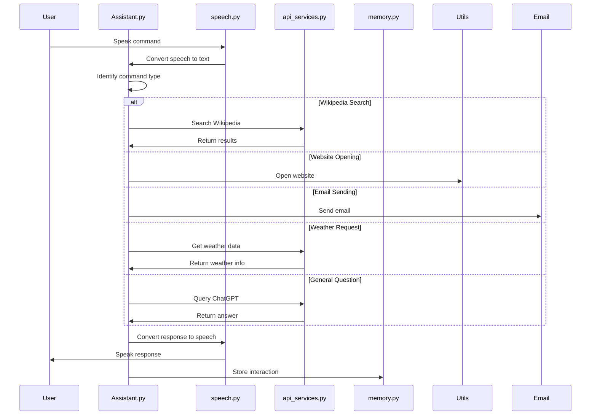
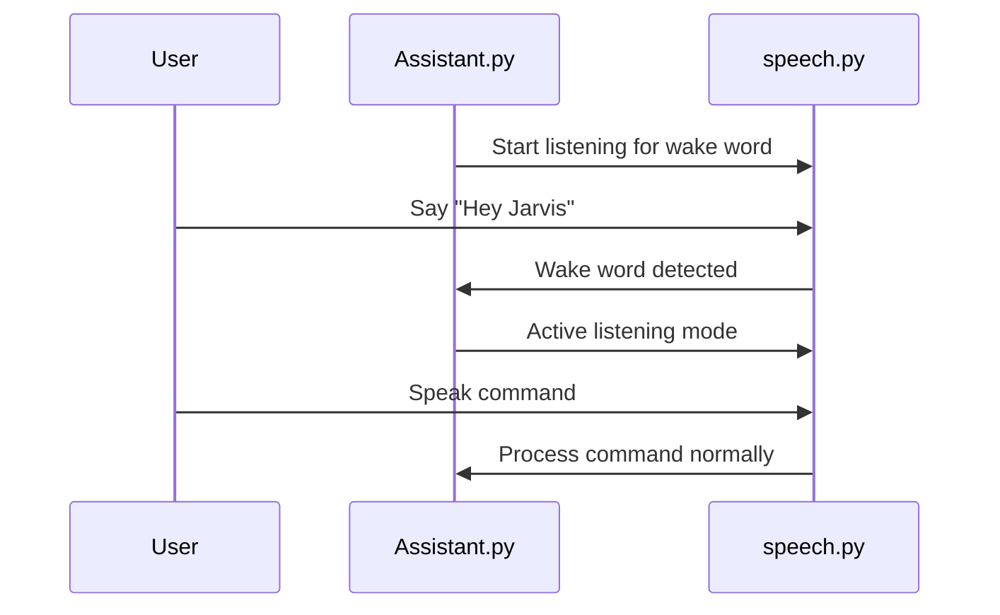
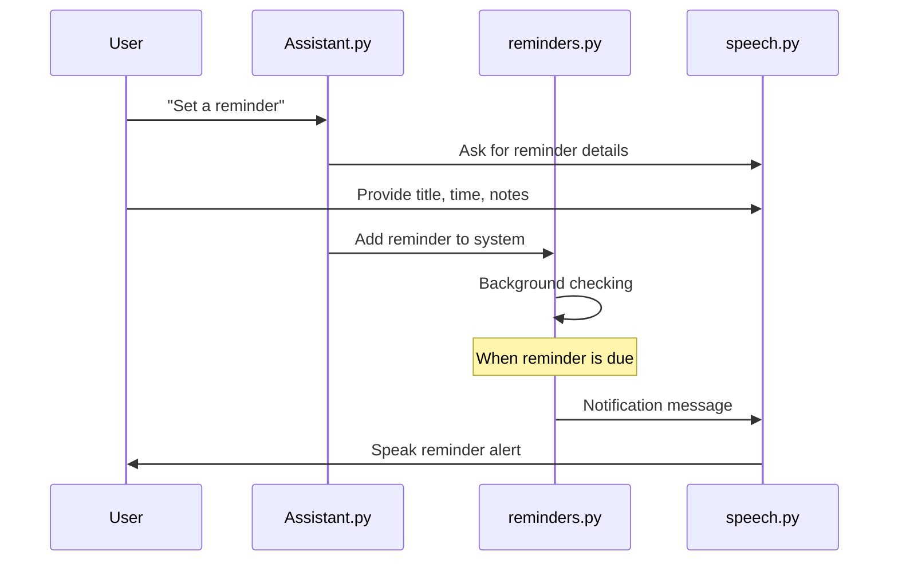

# Voice Assistant Workflow Documentation

## System Overview

This document outlines the workflow and interaction between different components of the intelligent voice assistant system.

## Core Components

1. **Main Controller (Assistant.py)**
   - Initializes all components
   - Manages the main interaction loop
   - Processes user commands
   - Coordinates between different modules

2. **Speech Engine (speech.py)**
   - Handles text-to-speech conversion
   - Manages speech recognition
   - Listens for wake words
   - Adjusts for ambient noise

3. **Memory System (memory.py)**
   - Stores user preferences
   - Records conversation history
   - Manages contact information
   - Remembers custom commands

4. **Reminder System (reminders.py)**
   - Schedules and tracks reminders
   - Runs background monitoring thread
   - Notifies when reminders are due
   - Manages reminder completion status

5. **API Services (api_services.py)**
   - Connects to ChatGPT for answering questions
   - Retrieves weather information
   - Fetches news updates
   - Gets random jokes

6. **Email Service (email_service.py)**
   - Manages secure email sending
   - Handles SMTP connection
   - Uses environment variables for credentials

7. **Utilities (utils.py)**
   - Provides helper functions
   - Manages file operations
   - Handles website and application opening

## Workflow Sequence

### 1. Initialization Process

### 2. Command Processing

### 3. Hotword Activation Mode

### 4. Reminder Processing

## Data Flow

### User Interaction Flow
1. User speaks a command
2. Speech recognition converts audio to text
3. Command processor identifies intent
4. Appropriate module handles the request
5. Response is generated
6. Text-to-speech converts response to audio
7. User hears the response
8. Interaction is stored in memory

### Memory Storage Flow
1. User preferences are saved to JSON
2. Conversations are recorded with timestamps
3. Contact information is stored for email functionality
4. Custom commands are saved for future use
5. Memory persists between sessions

## Setup and Requirements

### Environment Setup
1. Install required Python packages
2. Configure environment variables
3. Set up API keys (OpenAI, Weather, News)
4. Configure email credentials
5. Customize assistant settings in config.py

### Running the System
1. Standard mode: `python Assistant.py`
2. Hotword activation: `python Assistant.py --hotword`

## System Requirements

- Python 3.6+
- Internet connection for API services
- Microphone for speech input
- Speakers for audio output
- API keys for external services

## Troubleshooting

### Common Issues:
1. **Speech recognition fails**
   - Check microphone connection
   - Reduce background noise
   - Verify internet connection

2. **APIs not responding**
   - Verify API keys in .env file
   - Check internet connectivity
   - Ensure rate limits haven't been exceeded

3. **Email sending fails**
   - Verify SMTP settings
   - Check email credentials
   - Enable "Less secure app access" for Gmail

4. **Reminders not triggering**
   - Verify time format (YYYY-MM-DD HH:MM)
   - Check if background thread is running
   - Ensure system time is accurate

## Future Enhancements

1. Multi-language support
2. Voice identification for multiple users
3. Integration with smart home devices
4. Calendar synchronization
5. More sophisticated NLP for complex commands
6. Mobile app companion

---

*Generated for the AI Assistant project documentation*
